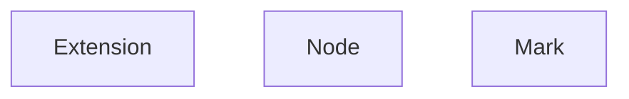

## Editor
```js
 class Editor{
    view: EditorView - 视图（来源于prosemirror-view）
    extensionManager: ExtensionManager — 拓展管理器
    commandManager: CommandManager — 命令管理器

 }
```


## vue-editor
```js
class VueEditor extends Editor{

}
```

## vue-editor-content 只是用元素进行editor包裹，最后还是会将元素设定为editor的element
```js
export const VueEditorContent: component = {
watch{
    editor:{
        handler(){
            editor.setOptions{element}
            editor.createNodeViews()
        }
    }
}
}
```


## ExtensionManager  拓展管理器
```js
class ExtensionManager{
    extensions: Extension[] (Extension | Node | Mark)
}
```

## 流程
- new Editor
- createExtensionManager创建ExtensionManager（构建schema）
  - 解析出nodes、marks
    - nodes解析，将parseHTML方法解析为schema.parseDOM、将renderHTML转换为schema.toDOM
    - marks解析，将parseHTML方法解析为schema.parseDOM、将renderHTML转换为schema.toDOM
  - 构建schema
    - 基于nodes，构建NodeType组成的nodes，(上一步的NodeSchema会赋值给NodeType的spec) —— spec包含schema的原始数据
    - MarkTypes
- createView创建doc（层级结构）
  - 基于schema、content、parseOptions创建doc
    - 从prosemirror-model的from_dom中使用DOMParser.fromSchema构建DOMParser，解析对象
      - DOMParser.fromSchema中，会使用DOMParser.schemaRules，解析schema中的rules（就是从marks、nodes中解析出parseDOM）
        - DOMParser.schemaRules会根据parseHTML/parseDOM中每个rule的priority，排列优先级；可以在parseHTML/parseDOM中设置priority
      - Nodes的parseHTML返回的数组中的每一项，都会解析为一个rule
    - 使用parser.parse(content)解析content 字符串内容(使用elementFromString解析为dom)，根据rule匹配创建不同的node，从而构建doc层级
      - 根据elementFromString解析为的dom，在递归创建NodeType时，会根据每次循环的dom，通过parser.matchTag匹配到对应的rule；DOMParser在之前的构建中，会得到rules、tags；
        - 1.先根据dom.matches(选择器)方法，判断rule.tag是否能匹配上
        - 2.再根据rule.getAttrs(dom)方法，对比新旧attrs
        - 3.先匹配上的先返回，所以之前设置的priority会决定顺序
      - 根据获取的rule.node，通过addElementByRule方法，获取到schema.nodes中对应的NodeType，进行创建nodeType.create

- createView创建EditorView
  - prosemirror-view的EditorView中使用docViewDesc，对doc进行进行描述渲染
    - 递归处理doc的children
    - NodeViewDesc.create中，使用DOMSerializer.renderSpec处理每个Node
      - 会先调用node.type.sepc.toDOM，调用Node的renderHTML方法；
      - 然后使用renderSpec将返回的内容进行处理，生成spec（真实dom）
        - renderSpec，获取到自定义Node的renderHTML返回的结构后，会针对不同的结构进行解析，构建dom(例如: 'span'、['span', '123']、['span', {class: 'test'}]...)


### 节点匹配规则
- 先通过传入的extensions(Node实例)，Node.create，会指定type为node、name为自定义的节点类型
- ExtensionManager中，将extension.type拆分为nodes、marks
- 根据解析出来的nodes、marks,构建schema，schema中的nodes、marks起始是不同的NodeType、MarkType；用于后续真实dom渲染时知道匹配那个Node去渲染
- 构建doc的时候，就通过parser解析到对应的Node，构建doc层级
- 创建EditorView的时候，使用docViewDesc，调用实际的renderHTML

## todo
- 如何根据内容匹配上对应的自定义Node的？ —— 好像是根据parseHTML匹配? - Editor createView构建doc阶段处理的？
- 如何手动构建自定义Node?
- 监听suggestion逻辑是什么?
- renderText 逻辑是什么? 渲染元素的文本内容?