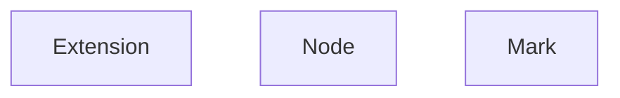

## Editor
```js
 class Editor{
    view: EditorView - 视图（来源于prosemirror-view）
    extensionManager: ExtensionManager — 拓展管理器

 }
```


## vue-editor
```js
class VueEditor extends Editor{

}
```

## vue-editor-content 只是用元素进行editor包裹，最后还是会将元素设定为editor的element
```js
export const VueEditorContent: component = {
watch{
    editor:{
        handler(){
            editor.setOptions{element}
            editor.createNodeViews()
        }
    }
}
}
```


## ExtensionManager  拓展管理器
```js
class ExtensionManager{
    extensions: Extension[] (Extension | Node | Mark)
}
```
